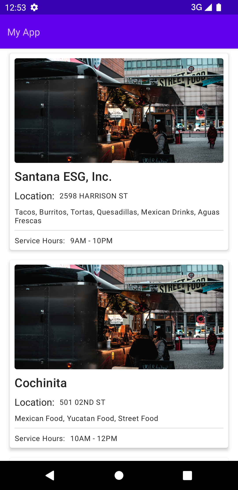
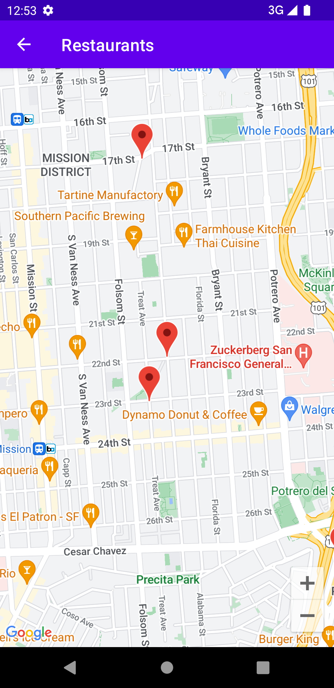

# ComposeWithGoogleMaps
A project to play with Jetpack Compose and GoogleMaps

## Frameworks
1. Jetpack Compose (Google UI)
2. Dagger 2 (Dependency Injection)
3. Retrofit (REST API)
4. Coil (Image Rendering)
5. Compose Destinations for [Navigation] (https://github.com/raamcosta/compose-destinations)
6. Kotlin Coroutines for Async work

## Architecture
1. MVVM guidelines

## Next steps
I'd like to implement a detail BottomSheet to display more info related to the selected the marker. 

